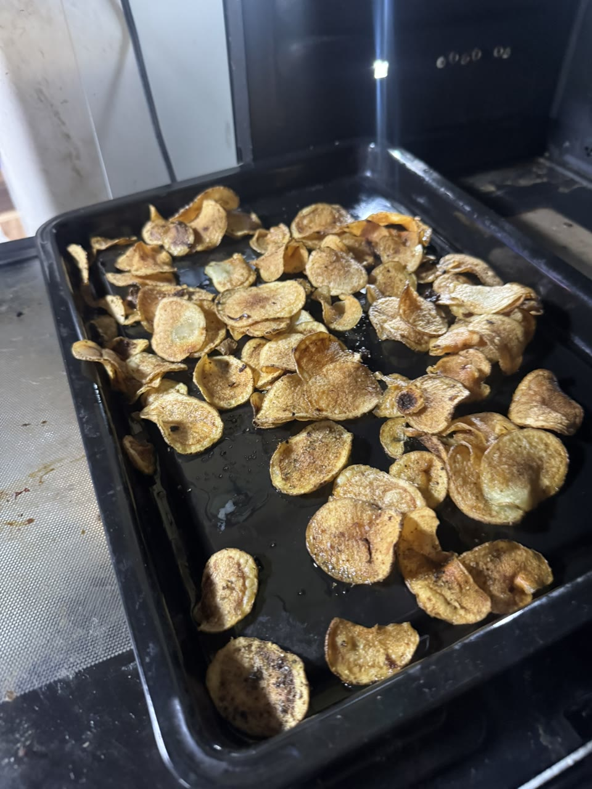
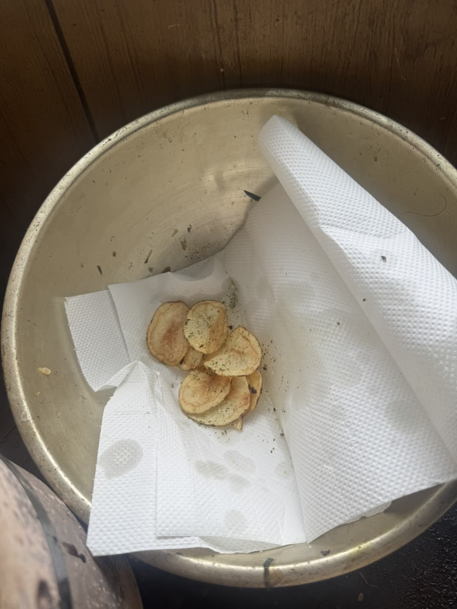

# Open Source Potato Chips 🥔
## 家庭用 Potato Thermal Technology

**日本語（正本）** | [English (US) — Texas garage-lab edition](./README.us-en.md)

> 働かない。でもポテチは食う。  
> 成果物は食う。有益だった知識は社会へ還元する。

ニートでお金ないけどポテチ食いたい！！！！

👉 **作れば良くね？**

というところから始まった、家庭用ポテトチップス製造実験です。

自作ポテチには有名な既知Issueがあります。

**「揚げたのにサクサクしない。なんかフニャる。」**

そこで、カルビーや湖池屋などが一般公開しているポテトチップス製造技術・製法上の知見を参考に、

**「各工程が何の物理的・食品工学的仕事をしているのか」**

を分解しました。

業務用製造ラインそのものをコピーするのではなく、家庭に存在する次の設備へ機能を再配置します。

- 揚げ物鍋 / フライヤー
- オーブン
- クッキングシート
- 人間の口

特定企業の非公開ノウハウを利用するものではなく、公開情報と一般的な食品科学上の知見から、家庭用設備向けに独立して構成した実装です。

名付けて、

## Potato Thermal Technology 家庭版OSS実装

<p align="center">
  
</p>

> 実機試験の成果物。見た目を作るための生成画像ではなく、このREADMEに記載した家庭設備で調理したポテトチップスです。

---

## TL;DR

基本パイプラインはこれです。

```text
ジャガイモ
   ↓
薄切り
   ↓
Fry
   │  糊化
   │  蒸気発生
   │  多孔質構造形成
   ↓
揚げ上がり直後
   ↓
Flavoring
   │  表面油＋残留水分を利用して
   │  フレーバーを定着
   ↓
油切り
   ↓
Oven 210℃
   │  高温短時間の追い乾燥
   │  多孔質構造を乾燥固定
   ↓
Cooling
   ↓
🥔 POTATO DEPLOYED
```

重要なのは、

> **油でしかできない仕事だけ油にやらせる。**  
> **乾燥はオーブンに投げる。**

です。

---

## 1. ジャガイモを薄切りする

普通のジャガイモをポテトチップス程度の厚さへスライスします。

ただし、本実装ではスライス厚を厳密な固定値にしていません。

ジャガイモは、

- 品種
- 産地
- 収穫時期
- 保存状態
- 含水率
- デンプン量

などによって挙動が変化します。

家庭用スライサーにも個体差があります。

したがって、後述するオーブン工程を固定時間ではなくフィードバック制御します。

---

## 2. Fry工程
### 芋を「微細ポテートスポンジ」にする

薄切りしたジャガイモを通常の揚げ物として揚げます。

ここで重要なのは、単に「油で焼いている」わけではないことです。

ジャガイモ内部の水分が加熱され、

**液体の水 → 水蒸気**

となって外部へ抜けていきます。

同時にデンプンは加熱され、組織構造も大きく変化します。

結果として、チップ内部には細かな空隙が形成されます。

雑に言えば、

> **芋が油の中でフィーバーして、水蒸気によって微細スポンジになる。**

工程です。

Fry工程の主な役割は、

- デンプンの糊化
- 急速な水蒸気発生
- 多孔質化
- 揚げ物特有の風味形成

です。

ここまでがフライヤーのお仕事。

---

## 3. 油だけで最後まで追い込まない

家庭の揚げ物鍋だけで完全な乾燥状態まで追い込もうとすると、

- 油の長時間加熱
- 鍋内部の温度分布
- 局所的な過熱
- 温度計測位置との差
- 油の状態による発煙特性の変化

など、管理すべき変数が増えます。

そして今回、本当に欲しいものは、

**「異常に熱い油」ではありません。**

欲しいのは、

**「水分の少ないサクサクしたポテチ」**

です。

ならば、油である必要がなくなった時点で別工程へ移します。

---

## 4. Flavoring工程
### フレーバー投入タイミングは「揚げ上がり直後」

ここはかなり重要です。

味付けは完成後ではありません。

基本フローは、

```text
揚げ上がり
    ↓
クッキングシートへ
    ↓
即フレーバー投入
    ↓
油切り ＋ フレーバー定着
    ↓
オーブン
```

です。

使用するフレーバーは自由です。

例えば、

- マジックソルト
- コンソメ系シーズニング
- オニオン系
- サワークリーム系
- 業務用ポテトシーズニング
- その他「プロポテチの白い粉」

など。

### なぜ揚げ上がり直後なのか？

完全に乾燥し、表面油まで落ちてから粉末調味料を投入すると、フレーバーが十分に定着しません。

すると、

> ポテチを食っているのか  
> ハッピーターンの粉だけ舐めているのか分からない

という悲壮感ある **Bad Trip Potato** が発生します。

逆に、揚げる前から大量にフレーバーを付けると、調味成分が揚げ油側へ逃げたり、加熱されすぎたりします。

そこで狙うのが、

**揚げ上がった直後の短い時間窓**

です。

この時点では表面に油が存在し、チップ側にもまだ水分が残っています。

この油分・水分をフレーバー粒子の定着に利用します。

```text
Potato:
「まだちょっと湿ってます」

Flavor Powder:
「今だ！！！！」

        ↓

HYPER BINDING
```

その後、クッキングシート上で余分な油を落とします。

<p align="center">
  
</p>

> 揚げ上がり直後にフレーバーを投入し、余分な油を切っている状態。

---

## 5. Oven工程
### 210℃・高温短時間で追い乾燥

油を切ったチップを、

**210℃に予熱したオーブン**

へ投入します。

> [!WARNING]
> **210℃はオーブンの設定温度です。**  
> **揚げ油を210℃まで加熱するという意味ではありません。**

この工程で欲しいのは二度目の「揚げ」ではなく、

**残留水分の急速な除去**

です。

Fry工程ですでに作った多孔質構造から残留水分を抜き、サクサクした構造へ仕上げます。

<p align="center">
  
</p>

> 実機のオーブン設定表示。写真の210℃は揚げ油ではなく、Oven工程の設定温度です。

```text
Fryer
├─ 糊化
├─ 蒸気膨張
└─ 多孔質化

Flavoring
└─ 表面油・残留水分を利用したフレーバー定着

Oven
├─ 急速乾燥
└─ 多孔質構造の乾燥固定

Cooling
└─ 最終的な食感・風味の安定化
```

という責務分離です。

---

## 6. オーブン時間は指定しません

ここが本レシピの重要ポイントです。

**「210℃で○分」**

という固定時間にはしません。

理由は単純で、

**芋が毎回違うからです。**

同じジャガイモという名前でも、

- スライス厚
- 品種
- 産地
- 含水率
- 保存状態
- Fry工程でどこまで水が抜けたか
- オーブンの実温度
- 熱風の流れ
- 天板上の位置

などで必要時間が変化します。

そこで、本実装では高度なセンサーを導入します。

# 人間です。

## 5分ごとにつまみ食いしてください。

これが正式な制御アルゴリズムです。

```text
5分経過
   ↓
つまみ食い
   ↓
┌─────────────────┐
│ まだフニャる？   │── YES → 加熱継続
└─────────────────┘
   │ NO
   ↓
┌─────────────────┐
│ サクサクで旨い？ │── NO → 状態を見て継続
└─────────────────┘
   │ YES
   ↓
POTATO DEPLOYED
```

焦げ始めた場合はオーバーフィッティングです。

速やかにロールバックしてください。

これは、

**Human-in-the-loop Potato Control System**

です。

---

## 7. Cooling工程
### 焼き上がったら冷却する

狙った食感になったら加熱終了です。

取り出すなどして、余熱による加熱継続を避けながら冷却してください。

そして、

# できれば冷めてから食べてください。

理由は火傷防止だけではありません。

熱い状態と冷えた状態では、

- 食感
- 香り
- 塩味の感じ方
- フレーバー全体の印象

が変化します。

特に粉末シーズニングを強めに投入した個体を熱々の状態で連続投入すると、

```text
うっっっま！！！！

↓

味、濃っっっ！！！！
```

となりがちです。

完成判定には冷却後の試食も含めてください。

---

## 8. 湿気たポテチのRecoveryにも使える

この方式は、新規ポテチ製造だけでなく、

**湿気てサクサク感を失ったポテトチップスの再乾燥**

にも応用できます。

つまり本プロジェクトには、

```text
POTATO_BUILD
```

だけでなく、

```text
POTATO_RECOVERY
```

もあります。

湿気によって失われた食感であれば、適切な再乾燥によってある程度回復できる場合があります。

ただし、酸化などによってすでに風味そのものが劣化している食品を新品へ戻す技術ではありません。

---

## 設計思想

このプロジェクトの中心にある考え方は、

**「製法をコピーする」のではなく「工程の機能を読む」**

ことです。

業務用ラインで二段階の熱処理が行われていたとしても、家庭に同じ設備はありません。

ならば、

> その装置は何を達成するために存在するのか？

まで抽象化します。

必要なのが「追加の油加熱」ではなく「残留水分の除去」であるなら、

**別の熱源へ移植できます。**

これは料理というより、

**ポテチ製造アルゴリズムの家庭用ハードウェアへのPorting**

です。

---

## Safety

本プロジェクトでは、揚げ油を必要以上の高温まで追い込むことを推奨していません。

**210℃はオーブン設定温度です。**

揚げ物工程では、使用する油・調理器具・フライヤー等の通常の安全上の注意に従ってください。

また、オーブンの設定温度と庫内実温度には機種差があります。

高温の天板、油を含んだ食品、クッキングシート等を扱うため、加熱中は放置せず状態を確認してください。

焦げ・発煙など異常があれば加熱を中止してください。

---

## Status

**v0.2 Experimental / EATABLE**

実機試験：

- 家庭用フライヤー / 揚げ物鍋
- 家庭用オーブン
- Oven setpoint: 210℃
- Human-in-the-loop sampling: 5 min interval
- Result: **ちゃんとポテチになった 😼🥔**

画像3点は、この試験の揚げ上がり、オーブン運転、焼成後を記録したものです。個別の芋、スライス厚、機器差を越えた固定時間までは主張しません。

---

## 改良・再現実験のノートを追加する

別品種、スライス厚、器具、フレーバー、湿気Recovery等を試した場合は、[`note/`](./note/)へ実験ノートを追加できます。

- [`note/AGENTS.md`](./note/AGENTS.md) — 観測、考察、仮説、ポエム、unknownの分離規約
- [`note/TEMPLATE.ja.md`](./note/TEMPLATE.ja.md) — 複製用テンプレート

成功だけでなく、フニャった、焦げた、味が付かなかった等の失敗記録も歓迎します。ノートは`[DRAFT]`であり、置いただけで標準レシピへ昇格しません。

---

## Philosophy

芋はもらう。

ポテチは自分で作る。

成果物は自分で食う。

でも、

**有益だった知識は社会へ還元する。**

働かない。  
ポテチは食う。  
研究開発はする。  
知識は囲わない。

# 合法オープンソースポテチです。🥔🌱

---

## README画像の圧縮

`img/` のJPEGは、公開前に長辺1280pxへ縮小し、Exif/GPS等の撮影メタデータを除去しています。再処理用スクリプトは [`lib/compress_readme_images.py`](./lib/compress_readme_images.py) です。

```bash
python3 lib/compress_readme_images.py
```

実行には `ffmpeg` が必要です。スクリプトは変換成功後に元JPEGを同名の圧縮済みファイルへ置き換えます。

---

## License

このドキュメントおよびレシピは **CC BY 4.0 + Remix Declaration** で公開します。

再利用・改変・再配布・商用利用を許可します。原作者表示を残し、改変した場合は改変内容を明示してください。

詳細は [`LICENSE`](./LICENSE) を参照してください。
