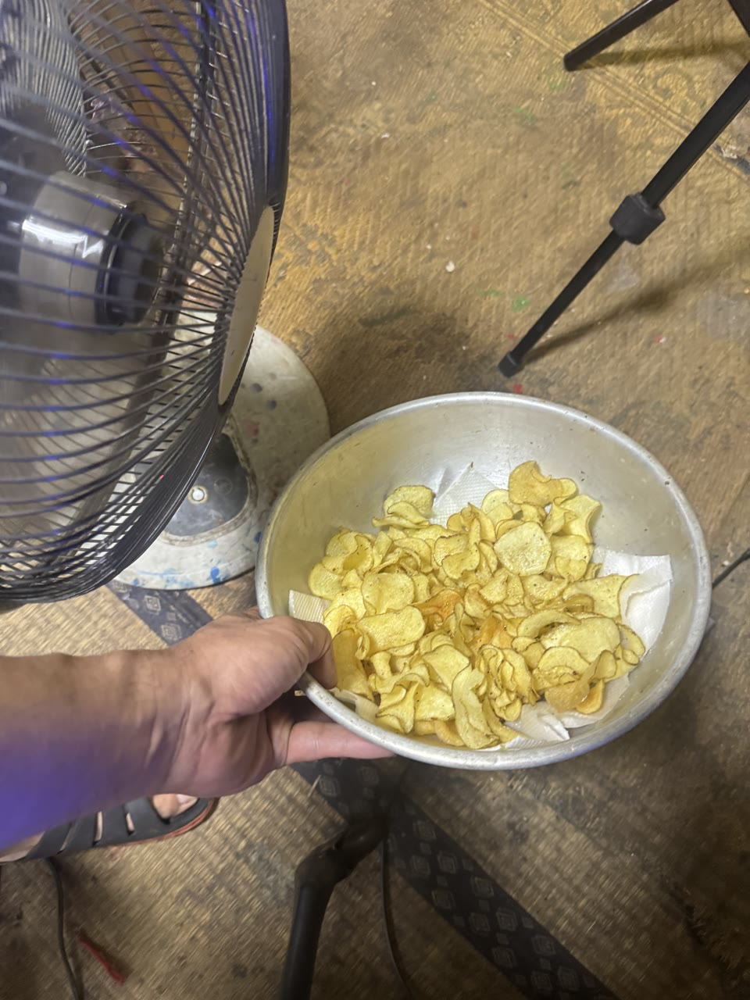
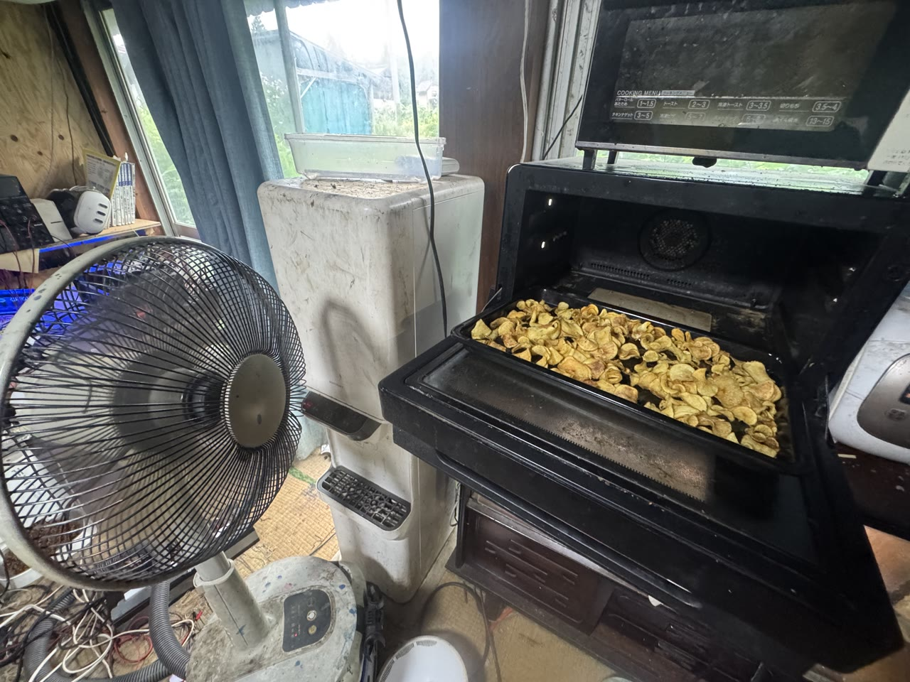

# 送風をOven前後へ追加した実機結果

作成日時: 2026-07-26 13:49 JST

作成者／agent: User + Codex（Codexは写真整理と記録のみ。調理・試食はしていない）

状態: `[DRAFT]`

種別: `[REPRODUCTION]` `[IMPROVEMENT]` `[HYPOTHESIS]`

## 対象・範囲・除外

- 対象: Flavoring後・Oven投入前と、Oven終了直後に扇風機による送風を追加した一回の実機試行
- 今回確認すること:
  - Userが報告した工程差分
  - 送風・Oven・完成チップの写真receipt
  - 「ご機嫌になった」というHuman Observer結果
- 確認しないこと:
  - 送風による水分量、油量、温度の定量変化
  - 送風なし対照群との統計的差
  - 全員にとっての味、食感、食品安全
  - README正本への標準工程追加

## 元にしたレシピ／revision

- READMEまたはノート:
  - [`../README.md`](../README.md)
  - [`20260726-1323__悪天候で一次フライがご機嫌斜めになるか.ja.md`](20260726-1323__悪天候で一次フライがご機嫌斜めになるか.ja.md)
- Git commit／revision: `c872c7a743c6cbb171904139be202aeffa7940f0`
- 元手順から変えた箇所:
  - Flavoring・油切り後、Oven投入前に扇風機で送風した
  - Oven終了直後にも扇風機で送風した

この工程差分はUserの報告に基づく。送風時間、風速、距離、向きは未計測である。

## 既存ツール確認

- 探索した`lib/`／`scripts/`:
  - `lib/compress_readme_images.py`
  - `lib/README.md`
- 再利用したツール: `lib/compress_readme_images.py`
- 引数: 対象3枚だけを置いた一時ディレクトリ、`--max-edge 1280 --qscale 3`
- 副作用: JPEGをin-place再エンコードし、長辺を1280px以下へ縮小してExif/GPSを除去
- 新しいツールを作った場合、その理由: 新設なし

既存`img/`内の公開済みJPEGを再圧縮しないため、対象3枚だけを一時ディレクトリへ複製して既存ツールを実行し、変換結果を元pathへ戻した。

## 材料・設備・環境

- 芋: unknown
- 保存状態: unknown
- スライス方法／厚さ: 写真では薄切りを確認できるが、方法と数値はunknown
- 油: unknown
- Fry器具: unknown
- Oven: 写真に家庭用Ovenを確認。機種、設定温度、実温度はunknown
- フレーバー: 投入済みとのUser報告。種類と量はunknown
- 送風設備: 写真に家庭用扇風機を確認。段、距離、風速、首振り、運転時間はunknown
- 室温・湿度等: 室内値は未計測。地域proxyは元ノートの高畠アメダスreceiptを参照
- 未計測:
  - batch質量
  - 粗熱取り前後の質量と表面温度
  - Oven時間
  - 完全冷却後の水分活性・含水率
  - 飛散したフレーバー量と落下油量

## 手順

User報告から復元できる範囲:

```text
Fry
  ↓
Flavoring
  ↓
油切り
  ↓
扇風機でOven前送風
  ↓
Oven
  ↓
Oven終了直後に扇風機で送風
  ↓
Human Observer確認
```

時間、風速、距離、Oven設定は推測で補わない。

## `[FACT]` 事実・観測

- User報告: 「オーブン前とオーブン直後に扇風機追加したらご機嫌なった」
- 写真:
  - `IMG_1045.jpeg`: 扇風機の近くに、ボウル内の多数のチップがある
  - `IMG_1048.jpeg`: 扉を開いたOven内の2トレイにチップがあり、近くに扇風機がある
  - `IMG_1049.jpeg`: 手に持った完成チップと作業画面がある
- 元画像のカメラ記録時刻:
  - `IMG_1045.jpeg`: 2026-07-26 13:31:34
  - `IMG_1048.jpeg`: 2026-07-26 13:38:36
  - `IMG_1049.jpeg`: 2026-07-26 13:38:56
- カメラ時計の正確性と、記録時刻が各工程の開始・終了時刻であることは未確認
- 画像だけではfanの運転状態、風量、風向、温度、水分lossを確認できない
- Fry終了判断: unknown
- フレーバー投入時点: Fry後、Oven前とのUser報告
- Oven設定温度: unknown。READMEの210℃を今回も使ったとは推測しない
- Oven実温度: 未計測
- 試食間隔: unknown
- 冷却後: Human Observerから改善報告あり。完全冷却までの時間はunknown
- 焦げ／煙／油跳ね／その他異常: Userから異常報告なし。異常がなかったことの完全な確認ではない

## `[RESULT]` 結果

- 食感: UserのHuman Observer判定では「ご機嫌になった」
- 味: 詳細unknown
- 成功／部分成功／失敗／中止: 一回のUser報告として部分成功
- 写真・log:

### Flavoring後・Oven前の送風候補



### Oven終了直後の送風候補



`IMG_1049.jpeg`はExif/GPS除去と圧縮までは完了したが、作業画面と画面内人物が写っているため公開対象から除外した。Human Reviewなしに顔や画面を加工した証拠画像へ置換しない。

## `[INTERPRETATION]` 考察

今回の結果は、送風粗熱取り仮説と整合する。しかし、Oven前送風とOven直後送風を同じbatchで同時に追加しているため、どちらが結果へ寄与したかは識別できない。

候補となる作用は次のとおり。

- Oven前送風が表面近くの湿った空気を更新した
- Oven直後送風が冷却中の表面水分移動を変えた
- Oven直後の送風で、食感確認時までの冷却速度が変わった
- 送風ではなく、今回の芋、厚さ、Fry、Oven時間、投入量が良かった
- 「ご機嫌」は水分だけでなく、温度、油、粉の定着、食べた時刻を含む複合的なHuman Observer判定だった

写真は工程の存在を補強するが、因果、水分量、安全、味を証明しない。

## `[HYPOTHESIS]` 仮説

次回は一度に二つの送風点を変えず、次の順で分離する。

1. 現行工程
2. Oven前送風だけ
3. Oven直後送風だけ
4. Oven前後の両方で送風

同一Fry batchを可能な範囲で分割し、少なくとも次を固定・記録する。

- 各群の開始質量と枚数
- fanの段、距離、向き、時間
- 室温と相対湿度
- Oven前後の表面温度
- Oven終了までの時間
- 完全冷却後のHuman Observer食感

送風前後の総重量差は、水分、落下油、飛散粉を分離できるまで`pre_oven_total_mass_loss`または`post_oven_total_mass_loss`とし、`water_loss`とは呼ばない。

## `[INNER]` 内観メモ／ポエム

> 雨の日のポテートに、熱だけではなく風の工程が生えた。
>
> ご機嫌は一回観測できた。理由はまだ風の中にある。

## `[UNKNOWN]` 未解決・識別不能

- Oven前送風とOven直後送風の寄与率
- 送風なし対照との再現差
- 送風時間、風速、距離、向き
- Oven設定・実温度・投入時間
- 粗熱取り前後の質量・温度・水分量
- 冷却中の油移動とフレーバー脱落
- 完全冷却後の食感
- `IMG_1049.jpeg`の画面・画面内人物の公開権限

## 昇格候補

- READMEへ: なし。送風位置を分離した反復試験後に再検討
- `lib/`へ: なし
- manifest／他docsへ: なし
- 追加検証:
  - Oven前送風だけの群
  - Oven直後送風だけの群
  - 送風なし対照
  - 質量、温度、室内湿度を含むreceipt

## 安全停止

- 写真は実施receiptであり、安全推奨画像ではない。
- fanを揚げ油、火炎、加熱中のFry器具へ向けない。
- 熱いトレイは耐熱面へ置き、火傷と落下を防ぐ。
- 稼働中・高温のOvenへ外部fanで送風することは、機種ごとの冷却設計や説明書との整合がunknownである。次回は可能ならトレイを安全に取り出し、Oven本体ではなく耐熱面上の食品へ送風する。
- fanと周辺を清掃し、埃、髪、洗剤、異物を食品へ吹き付けない。
- 電源コードとfan本体を水、油、濡れた手、熱源から離す。
- 異臭、異常発煙、電源異常、油跳ね、火傷リスクがあれば食感検証を停止する。

## source・Provenance

- 食材・器具情報: User報告と写真から確認できる範囲
- 写真撮影者・権利: User提供。公開依頼あり。撮影者本人性と画面内第三者権利はCodex未確認
- 画像圧縮:
  - `IMG_1045.jpeg`: 4,177,929 bytes、5712x4284とorientation metadata → 172,237 bytes、960x1280
  - `IMG_1048.jpeg`: 2,981,249 bytes、4032x3024 → 231,641 bytes、1280x960
  - `IMG_1049.jpeg`: 2,163,122 bytes、4032x3024 → 165,098 bytes、1280x960
- Exif/GPS除去: 3枚とも除去を機械確認。ffmpeg encoder commentは残る
- 画像内容の確認:
  - `IMG_1045.jpeg`: 公開候補。顔、住所、伝票、画面なし
  - `IMG_1048.jpeg`: 公開候補。人物、住所、伝票、作業画面なし。窓外景観あり
  - `IMG_1049.jpeg`: 公開保留。作業画面と画面内人物あり
- 関連issue: [GitHub Issue #7](https://github.com/saitoomituru/OpenSourcePITETO/issues/7)
- 関連commit: 本note公開時に確定
